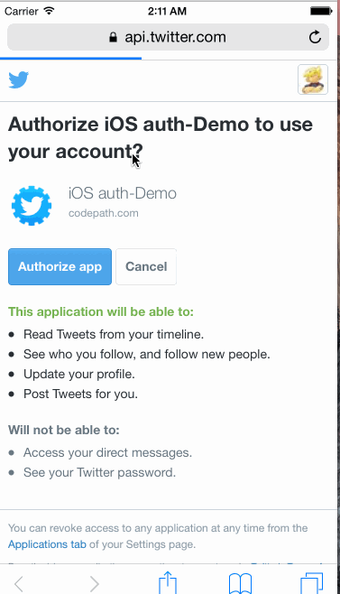

This is an ios Twitter app with hamburger menu.

Time spent: 14 hours

Completed:

[X]] Hamburger menu
[X] Dragging anywhere in the view should reveal the menu.
[X] The menu should include links to your profile, the home timeline, and the mentions view.
[X] The menu can look similar to the LinkedIn menu below or feel free to take liberty with the UI.
[X] Profile page
[X] Contains the user header view
[X] Contains a section with the users basic stats: # tweets, # following, # followers
[X] Home Timeline

